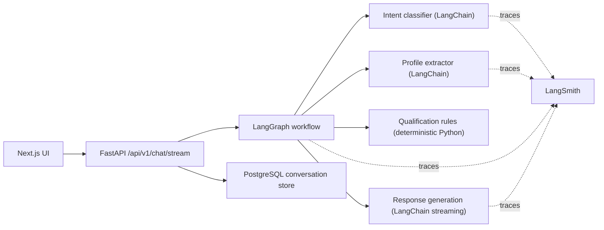

# owe-service

## Architecture



## LangSmith

This service supports optional LangSmith tracing for LangChain and LangGraph runs.

1. Copy [`.env.example`](/Users/jayden/workspace/github/owe/owe-service/.env.example) to `.env`
2. Set `LANGSMITH_TRACING=true`
3. Fill in `LANGSMITH_API_KEY`
4. Optionally change `LANGSMITH_PROJECT`

When enabled, traces are emitted for:

- intent classification
- profile extraction
- LangGraph workflow execution
- streamed response generation

Typical metadata you will see in traces:

- `session_id`
- whether the run resumed a previous conversation
- current language / prior mode
- response type such as general, qualification, clarification, or redirect

## Model Initialization

The chat model is configured once and initialized during application startup:

- `OPENAI_MODEL`

If model initialization fails, the application raises an error during startup and exits instead of waiting for the first request to fail.

## Logging

Set `LOG_LEVEL` in `.env` to control startup and runtime logging. The default is `INFO`, which will print model initialization messages during application startup.

## Database and Alembic

The project includes a minimal PostgreSQL + SQLAlchemy + Alembic setup.

Required environment variables:

- `DB_HOST`
- `DB_PORT`
- `DB_USER`
- `DB_PASSWORD`
- `DB_NAME`
- `DB_SCHEMA`

Typical workflow:

```bash
make pip
make migrate m="init owe schema"
make upgrade
```

## Container

A production Docker image can be built from [`Dockerfile`](/Users/jayden/workspace/github/owe/owe-service/Dockerfile).

The container starts with:

```bash
uvicorn app.main:app --host 0.0.0.0 --port 8000
```

## Release Flow

This repository includes a tag-driven GitHub Actions workflow at
[`/.github/workflows/release.yml`](/Users/jayden/workspace/github/owe/owe-service/.github/workflows/release.yml).

When a tag like `v0.1.0` is pushed, the workflow:

1. runs tests
2. builds a Docker image
3. pushes it to GHCR
4. updates the staging Helm values in `owe-devops`

## Evaluation

This repo includes a lightweight qualification evaluation suite with canned lead scenarios.

Run it with:

```bash
make eval
```

The evaluation cases currently cover:

- industrial instant-priority leads
- industrial follow-up leads that still need building age
- commercial month-to-month priority leads
- commercial tier-three nurture leads
- no-provider instant-priority leads
- Chinese business qualification input
- square-footage fallback estimation
